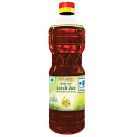

<!DOCTYPE html>
<html lang="en">
<head>
    <meta charset="UTF-8">
    <meta name="viewport" content="width=device-width, initial-scale=1.0">
    <title>KISAN</title>

<!-- all css file from fontawsome -->
    <link rel="stylesheet" href="./css/all.css">
    <link rel="stylesheet" href="./css/fontawesome.min.css">

<!-- custom styles by bootstrap -->
<link rel="stylesheet" href="https://stackpath.bootstrapcdn.com/bootstrap/4.4.1/css/bootstrap.min.css" integrity="sha384-Vkoo8x4CGsO3+Hhxv8T/Q5PaXtkKtu6ug5TOeNV6gBiFeWPGFN9MuhOf23Q9Ifjh" crossorigin="anonymous">

<!-- our own custom styles -->
<link rel="stylesheet" href="./css/style.css">

</head>

<!--********************************** body section **************************************************8 -->

<body>

<!-- main wrapper for page -->

<!-- header section starts-->

    <!-- header starting row starts here -->

    

        

            <ul>
            <li> <b>All Your Groceries On Your Doorstep</b></li>
            <!-- <li>8989898989</li>
            <li>sdbdkj@gmail.com</li> -->
            </ul>
        

        

            <a href="#"><i class="fab fa-facebook-f"></i></a>
            <a href="#"><i class="fab fa-instagram"></i></a>
            <a href="#"><i class="fab fa-linkedin"></i><a>
            <a href="#"><i class="fab fa-twitter"></i><a>
            <a href="#"><button>login</button></a>
            <a href="#"><button>sign up</button></a>
        

    

    <!-- header middle row starts here -->

    

        <h1>KISAN</h1>
        

            <form class="form-inline my-2 my-lg-0">
            <input class="form-control mr-sm-2" type="search" placeholder="Search" aria-label="Search">
            <button class="btn btn-outline-success my-2 my-sm-0" type="submit">Search</button> 
            </form>
            <button>your cart</button>
            <!-- <button>Total</button> -->
        

    

        <!-- header bottom row starts here -->

    

        <ul>
            <li> <a href="./contact.html">Contact Us</a> </li>
            <li><a href="./about.html">about</a> </li>
            <li><a href="./category.html">Category </a> </li>
        </ul>
    

<!--## header div ends here ## -->

<!-- carousel div starts here -->

 
    

    

        

        
        

        

        
        

        

        
        

    

    <a class="carousel-control-prev " href="#carouselExampleIndicators" role="button" data-slide="prev">
        
        Previous
    </a>
    <a class="carousel-control-next " href="#carouselExampleIndicators" role="button" data-slide="next">
        
        Next
    </a>
    

<!-------- carousel div ends here --------->
<h2> CATEGORIES</h2>
<!-- -------categories start here------- -->

    

        <h3>Fresh Vegetables directly picked up from local farms  <a href="#" >see all in category</a></h3>
    

    

    

    
    <h6>name of product</h6>
    <h5>price:null</h5>
    

    

    
    <h6>name of product</h6>
    <h5>price:null</h5>
    

    

    
    <h6>name of product</h6>
    <h5>price:null</h5>
    

    

    
    <h6>name of product</h6>
    <h5>price:null</h5>
    

<h3>Fresh Fruits directly picked up from local farms  <a href="#" >see all in category</a></h3>

    

    

<h6>name of product</h6>
<h5>price:null</h5>
    

    

        
        <h6>name of product</h6>
        <h5>price:null</h5>
    

    

        
        <h6>name of product</h6>
        <h5>price:null</h5>
    

    

        
        <h6>name of product</h6>
        <h5>price:null</h5>
    

    

    <h3>Other Products    <a href="#" >see all in category</a></h3>

    

    

    
    <h6>name of product</h6>
    <h5>price:null</h5>
    

    

        
        <h6>name of product</h6>
        <h5>price:null</h5>
    

    

        
        <h6>name of product</h6>
        <h5>price:null</h5>
    

    

        
        <h6>name of product</h6>
        <h5>price:null</h5>
    

<!-- -------## categories ends here ##------- -->

<!-- footer starts here -->

<footer>
    

        

        &copy 2020 KISAN all right reserved. 
        <a href="#"> terms of service</a>
        <a href="#">privacy policy</a>
        <a href="#">sitemap</a>
        

        

        <a href="#">BLOG</a>
        <a href="#">contact us</a>
        <a href="#">customer support</a>
        mob no. 8899889988
        email chckckc@gmail.com
    

    

</footer>

<!-- ##footer ends here## -->

<!--## main wrapper for page ends ##-->

<!-- scripts section -->

<!---------------- jquery script --------------->
    

    
    

<!-- ------------------ custom javascript link------------- -->
    

</body>
</html>
